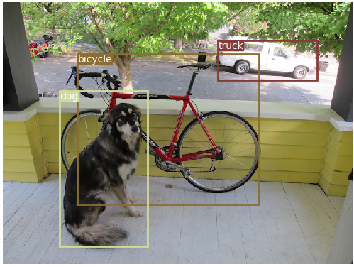
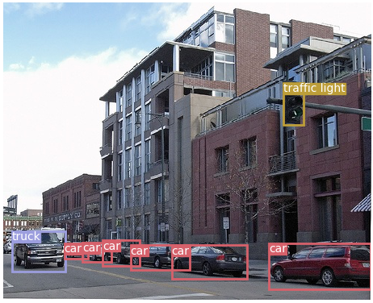

# yolo_torch
A minimal PyTorch implementation of YOLOv3, with support for training, inference and evaluation.

## Environment
    Linux ubuntu 16.04 lts,
    CUDA 9.0,
    CuDNN 7.0,
    Python 3.6.2,
    Pytorch 1.1.0

## Installation

### Using Conda

```
conda create -n env_name python = 3.6.2 
conda install pytorch=1.1.0 cuda90 -c pytorch
```

##### Clone and install requirements
    git clone https://github.com/Geonhee-LEE/yolo_torch.git
    cd yolo_torch/
    sudo pip3 install -r requirements.txt

##### Download pretrained weights
    cd weights/
    bash download_weights.sh

##### Download COCO
    cd data/
    bash get_coco_dataset.sh
    
## Test
Evaluates the model on COCO test.

    python3 test.py --weights_path weights/yolov3.weights

| Model                   | mAP (min. 50 IoU) |
| ----------------------- |:-----------------:|
| YOLOv3 608 (paper)      | 57.9              |
| YOLOv3 608 (this impl.) | 57.3              |
| YOLOv3 416 (paper)      | 55.3              |
| YOLOv3 416 (this impl.) | 55.5              |

## Inference
Uses pretrained weights to make predictions on images. Below table displays the inference times when using as inputs images scaled to 256x256. The ResNet backbone measurements are taken from the YOLOv3 paper. The Darknet-53 measurement marked shows the inference time of this implementation on my 1080ti card.

| Backbone                | GPU      | FPS      |
| ----------------------- |:--------:|:--------:|
| ResNet-101              | Titan X  | 53       |
| ResNet-152              | Titan X  | 37       |
| Darknet-53 (paper)      | Titan X  | 76       |
| Darknet-53 (this impl.) | 1080ti   | 74       |

    $ python3 detect.py --image_folder data/samples/

<p align="center"></p>
<p align="center"></p>
<p align="center"></p>
<p align="center"></p>

## Train
```
$ train.py [-h] [--epochs EPOCHS] [--batch_size BATCH_SIZE]
                [--gradient_accumulations GRADIENT_ACCUMULATIONS]
                [--model_def MODEL_DEF] [--data_config DATA_CONFIG]
                [--pretrained_weights PRETRAINED_WEIGHTS] [--n_cpu N_CPU]
                [--img_size IMG_SIZE]
                [--checkpoint_interval CHECKPOINT_INTERVAL]
                [--evaluation_interval EVALUATION_INTERVAL]
                [--compute_map COMPUTE_MAP]
                [--multiscale_training MULTISCALE_TRAINING]
```

#### Example (COCO)
To train on COCO using a Darknet-53 backend pretrained on ImageNet run: 
```
python3 train.py --data_config config/coco.data  --pretrained_weights weights/darknet53.conv.74
```

#### Training log
```
---- [Epoch 7/100, Batch 7300/14658] ----
+------------+--------------+--------------+--------------+
| Metrics    | YOLO Layer 0 | YOLO Layer 1 | YOLO Layer 2 |
+------------+--------------+--------------+--------------+
| grid_size  | 16           | 32           | 64           |
| loss       | 1.554926     | 1.446884     | 1.427585     |
| x          | 0.028157     | 0.044483     | 0.051159     |
| y          | 0.040524     | 0.035687     | 0.046307     |
| w          | 0.078980     | 0.066310     | 0.027984     |
| h          | 0.133414     | 0.094540     | 0.037121     |
| conf       | 1.234448     | 1.165665     | 1.223495     |
| cls        | 0.039402     | 0.040198     | 0.041520     |
| cls_acc    | 44.44%       | 43.59%       | 32.50%       |
| recall50   | 0.361111     | 0.384615     | 0.300000     |
| recall75   | 0.222222     | 0.282051     | 0.300000     |
| precision  | 0.520000     | 0.300000     | 0.070175     |
| conf_obj   | 0.599058     | 0.622685     | 0.651472     |
| conf_noobj | 0.003778     | 0.004039     | 0.004044     |
+------------+--------------+--------------+--------------+
Total Loss 4.429395
---- ETA 0:35:48.821929
```
#### Example (Carnumber : https://wingnim.tistory.com/58)
To train on Carnumber using a Darknet-53 backend pretrained on ImageNet run: 
```
python3 trainplate.py --data_config config/plate.data  --pretrained_weights weights/yolov3plate.weight
python3 detect.py --wights_path checkpoint/199.weight --image_folder data/samples/
```

## Tip
How to place labeled data so that it can be used for training.
     
    1. Create and move folder for specific task in path /data
    2. Create images folder, labels folder, xxxx.names, train.txt, valid.txt
    3. Place input data in the images folder
    4. Place label txt data in labels folder
    5. Open the A file and fill in the class.txt content created when labelling.
    6. In train.txt, enter the path to the input image file
    
When we're doing train
Chang in cfg file when you want to change CNN structure.

When you change the number of classes, you must also change the number of fillters in the above Convolution layer.

    number of filters = mask x (classes + 5)

yolov3.cig

    [convolutional]
    size=1
    stride=1
    pad=1
    filters=45
    activation=linear

    [yolo]
    mask = 0,1,2
    anchors = 10,13, 16,30, 33,23, 30,61, 62,45, 59,119, 116,90, 156,198, 373,326
    classes=10
    num=9
    jitter=.3
    ignore_thresh = .7
    truth_thresh = 1
    random=1

Data file nees to be modified to fit the cig file.
(Set number of classes, txt file path, name file path
    
    ex) plate.data
    
    classes= 10
    train=data/plate/traindir.txt
    valid=data/plate/validdir.txt
    names=data/plate/plate.names
    backup=backup/
    eval=plate


Train.py file, change the default path to input data or write additional details when running train.py ( checked as train.py -h )

    Change code (example) :
    parser.add_argument("--epochs", type=int, default=200, help="number of epochs")
    parser.add_argument("--model_config_path", type=str, default="config/yolov3plate.cfg", help="path to model config file")
    parser.add_argument("--data_config_path", type=str, default="config/plate.data", help="path to data config file")
    parser.add_argument("--weights_path", type=str, default="weights/yolov3plate.weights", help="path to weights file")
    parser.add_argument("--class_path", type=str, default="data/plate/plate.names", help="path to class label file")

Change the default path_size to a smaller size in the event of a CUDA low memory issue.

    parser.add_argument("--batch_size", type=int, default=5, help="size of each image batch")
    
Image files should use 'jpg' and 'png' files.
